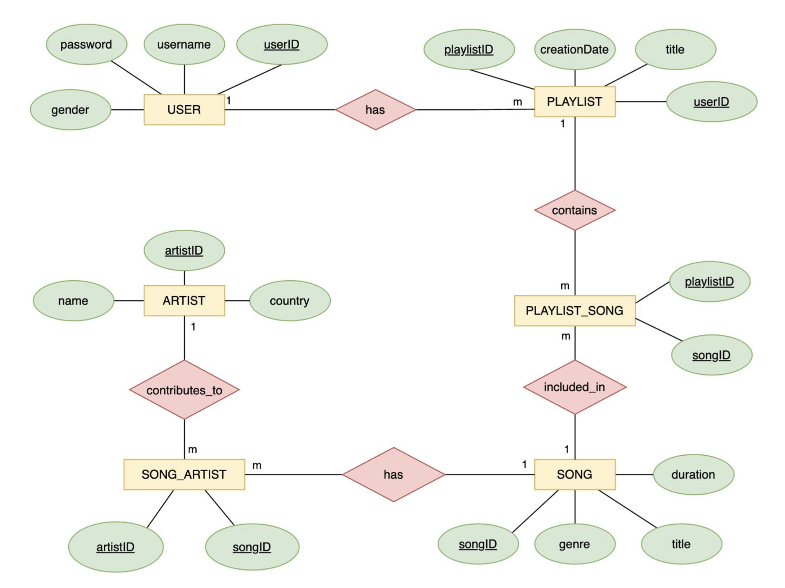

# Music DBMS

A full-stack music management system where users can create playlists, add songs, and link artists to tracks — powered
by **FastAPI**, **MySQL**, and a modern **Streamlit** frontend.

## 🧱 Tech Stack

- **Backend**: FastAPI (Python)
- **Database**: MySQL
- **Frontend**: Streamlit
- **ORM**: SQLAlchemy
- **Schema Validation**: Pydantic

## ⚙️ Features

- 👤 User creation
- 🎵 Add songs and assign genres/durations
- 🎨 Add artists and link them to songs
- 📀 Create playlists and add songs
- 🔗 Many-to-many relationships between:
    - Songs & Artists
    - Playlists & Songs
- 📊 View songs in playlists with artist info
- ✅ Fully interactive frontend with Streamlit

### ER Diagram

